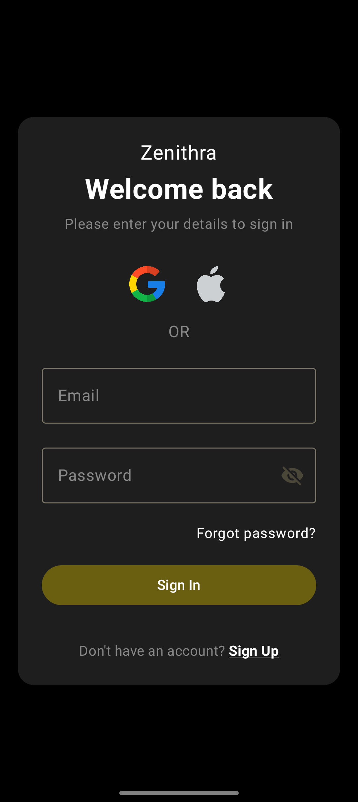
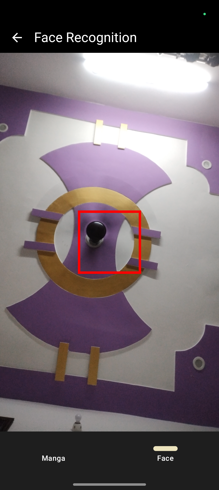
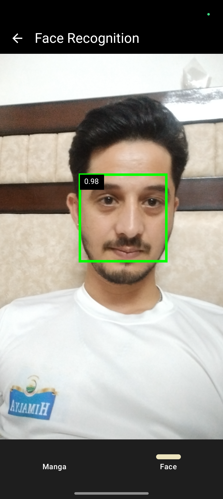

# mypupilmesh-assignment

## App Screenshots

[//]: # (### Login Screen)

[//]: # (![SignIn Screen]&#40;screenshots/signIn.png&#41;)

[//]: # ()
[//]: # (### Dashboard Manga GridList)

[//]: # (![Manga GridList Screen]&#40;screenshots/mangaList.png&#41;)

[//]: # ()
[//]: # (### Manga Details)

[//]: # (![Manga Detail Screen]&#40;screenshots/mangDetails.png&#41;)

[//]: # ()
[//]: # (### Face Recognition without face detect)

[//]: # (![Face Screen 1]&#40;screenshots/faceWithoutDetect.png&#41;)

[//]: # ()
[//]: # (### Face Recognition with face detect)

[//]: # (![Face Screen 2]&#40;screenshots/faceWithDetect.png&#41;)

  
  
  
  
  

